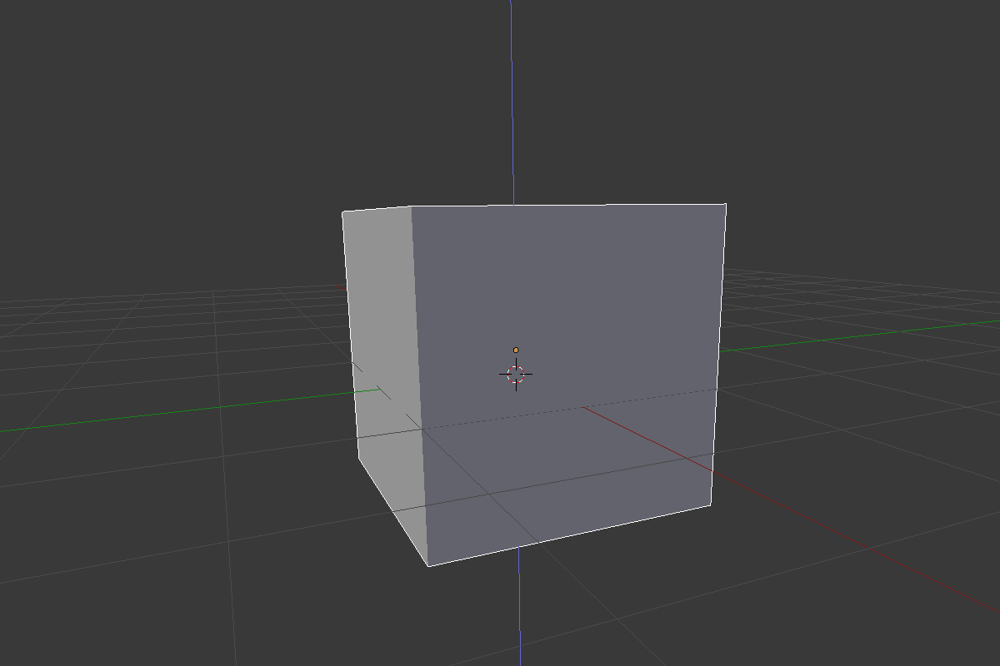

## 선택 및 이동하기

Blender에서 객체를 선택하려면 마우스 왼쪽 버튼을 사용해야 합니다.

+ 마우스 왼쪽 버튼으로 큐브를 선택하세요. 큐브 주위에 주황색 테두리가 나타납니다.

블렌더에서 파란색, 녹색 및 빨간색 핸들을 사용하여 객체를 이동할 수 있습니다. 파란색 핸들은 z축에서 위 아래로 이동하고, 녹색 핸들은 y축에서 왼쪽 및 오른쪽으로 이동하며, 빨간색 핸들은 x축에서 들어오고 나갑니다. Blender 2.8에서는 화면 왼쪽의 아이콘 목록에서 '기즈모 이동' 을 클릭하여 핸들을 표시해야합니다.

+ 마우스 왼쪽 버튼으로 파란색 핸들을 누르고 위로 움직여 큐브를 위로 이동하세요. 파란색 핸들을 누르면 파란색 선이 나타납니다. 파란색 선을 따라 큐브를 이동하세요.

+ 마우스 왼쪽 버튼으로 녹색 핸들을 누르고 오른쪽으로 이동하여 큐브를 오른쪽으로 이동하세요. 녹색 손잡이를 누르면 녹색 선이 나타납니다. 녹색 선을 따라 큐브를 이동하세요.

+ 마우스 왼쪽 버튼으로 빨간색 핸들을 누르고 앞뒤로 움직여 큐브를 안팎으로 움직입니다. 빨간색 핸들을 누르면 빨간색 선이 나타납니다. 빨간색 선을 따라 큐브를 이동하세요.

+ 장면 주위의 큐브를 다른 위치로 이동하세요.

+ 렌더 뷰로 이동하여 모양을 확인하세요. 예시:

큐브가 없거나 일부만 표시될 수 있습니다. 이것은 객체가 카메라의 시야에 (완전히) 들어와 있지 않다는 것을 의미합니다.

+ 렌더 뷰에서 나가기 위해 <kbd>ESC</kbd>를 누르세요.

+ 마우스 가운데 버튼을 사용하여 3D 장면을 카메라 뒤로 이동하세요. 예를 들면:

+ 카메라 뒤에서 큐브를 볼 수 있도록 파란색, 녹색 및 빨간색 핸들을 사용하여 큐브를 이동하세요.

+ 이미지가 어떻게 보이는지 다시 렌더링하세요. 아마도 이전과 같은 이미지를 보게 될 것입니다.

+ 렌더 뷰에서 나가기 위해 <kbd>ESC</kbd>를 누르세요.