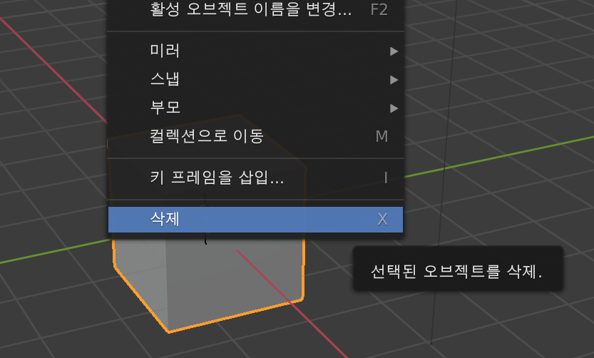
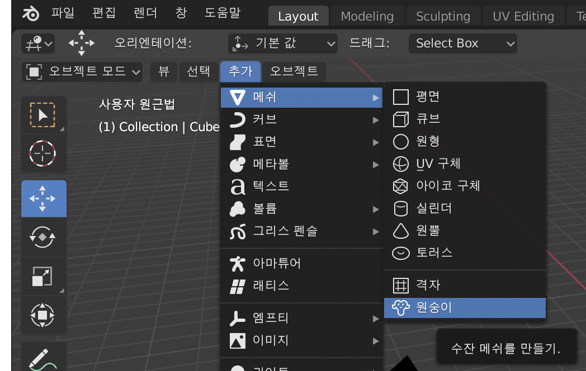

## 원숭이 추가하기

큐브가 필요하지 않으므로 제거하겠습니다.

+ 마우스 왼쪽 버튼으로 큐브를 선택하세요. 큐브 주위에 주황색 테두리가 나타날 것입니다.
+ 마우스가 3D 보기에 있는지 확인하십시오.
+ <kbd>X</kbd> 를 눌러 큐브를 지워주세요.
+ 객체를 삭제할 지 묻는 메시지가 표시됩니다.

+ **Delete**를 선택하거나 <kbd>Enter</kbd>를 누르세요.

장면에 객체를 추가하려면 **추가** 드롭 다운 메뉴를 사용하면 됩니다.

+ 메뉴에서 **메쉬** 섹션에 들어가서 **원숭이**를 선택하세요.

장면에 원숭이가 나타납니다.

+ 큐브와 마찬가지로 원숭이를 카메라 앞에 배치하여 렌더링 후에 볼 수 있도록 합니다. 파란색, 녹색 및 빨간색 핸들을 다시 사용하여 원숭이를 움직일 수 있습니다.

