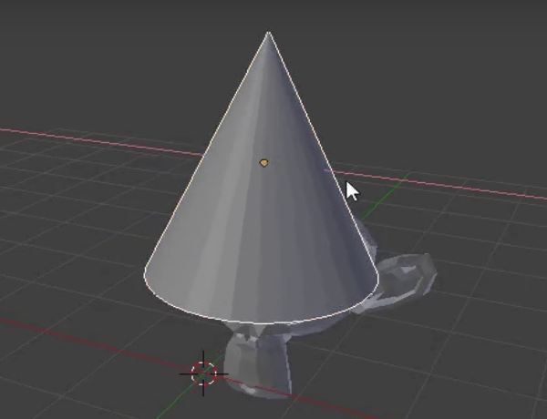

## 모자 추가하기

모자를 추가할 수도 있습니다. 이를 위해 원뿔을 사용할 것입니다.

+ **메쉬** 섹션에서 **원뿔**을 선택하세요.

장면에 원숭이가 나타날 것입니다. 이제 원숭이와 원뿔이 있습니다.

이제 원뿔은 원숭이 위에 위치해야 합니다.

+ 원뿔과 원숭이가 더 잘 보이도록 회전하고 확대해줍니다.

+ 마우스 왼쪽 버튼으로 원뿔(Cone)을 선택하세요. 주황색 테두리가 다시 나타날 것입니다.

+ 기즈모 이동과 파란색, 녹색 및 빨간색 핸들을 사용하여 원뿔을 원숭이 위로 움직입니다. 제대로 보기 위해 회전과 확대 또는 축소를 거쳐야 할 수도 있습니다.

+ 원뿔이 원숭이 위에 올바르게 위치했는지 여러 각도에서 확인하세요.

이제 어떻게 생겼는지 보아야겠습니다.

+ 이미지를 렌더링하세요.

원숭이가 잘 조명되지 않은 것 같습니다.

+ 렌더 뷰에서 나가기 위해 <kbd>ESC</kbd>를 누르세요.