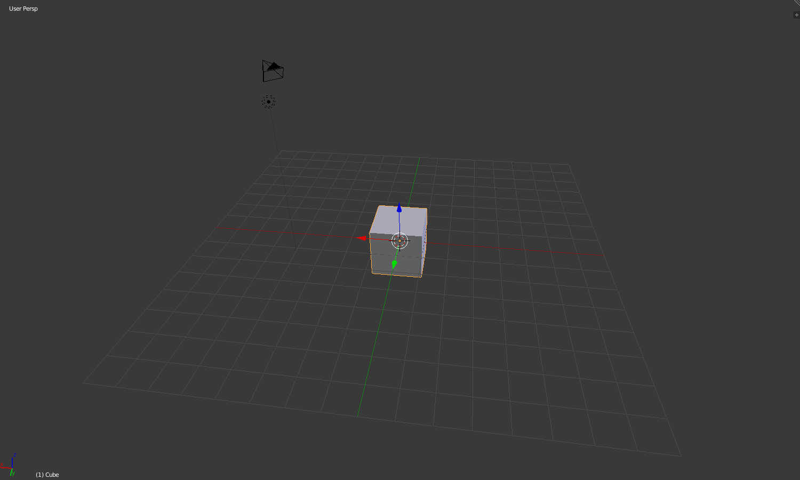

## Zoomen en draaien

+ Open Blender.

Wanneer je Blender opent, begint het met een startscherm. Het opstartscherm van Blender v2.76 ziet er als volgt uit:

Voor deze tutorial hebben we geen splash scherm nodig.

+ Klik rechts van het startscherm om het te laten verdwijnen.

In het midden zie je de 3D-weergave. In deze ruimte plaats je alle items die moeten worden weergegeven of gerenderd. Je ziet al drie verschillende voorwerpen in de 3D-weergave. Daar zullen we later naar kijken.

In de 3D-weergave kun je in- en uitzoomen met het muiswiel.

+ Probeer in en uit te zoomen op de kubus.

Je kunt de hele scène draaien door op de middelste muisknop of het muiswiel in te drukken en rond te draaien.

+ Probeer je scène te draaien.

