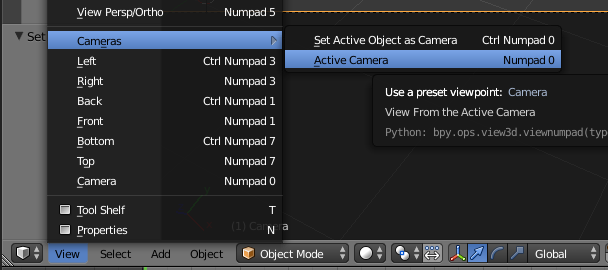

## De 3D-scène

In de 3D-weergave heb je je 3D-scène, die er een beetje uitziet als wat je bijvoorbeeld in een computerspel ziet.

Er zijn drie hoofdcomponenten in de 3D-scène die we moeten begrijpen om aan de slag te gaan.

### Een kubus in het midden

Dit wordt gerenderd en weergegeven in de afbeelding.

### Een lichtbron

Door de scène te draaien, kun je de exacte positie van de lichtbron zien.

+ Draai je scène totdat je de bovenkant van de lichtbron ziet.

### Een camera

Dit is van waaruit je je scène zult zien.

+ Draai je scène zodat deze zich achter de camera bevindt. Een eenvoudige manier om dit te doen, is door op je nummerriek toetsenbord op `0` te drukken of ga naar `View` > `Cameras` > `Active Cameras`.

 

Je ziet een mooie foto van de zijkant van de kubus.