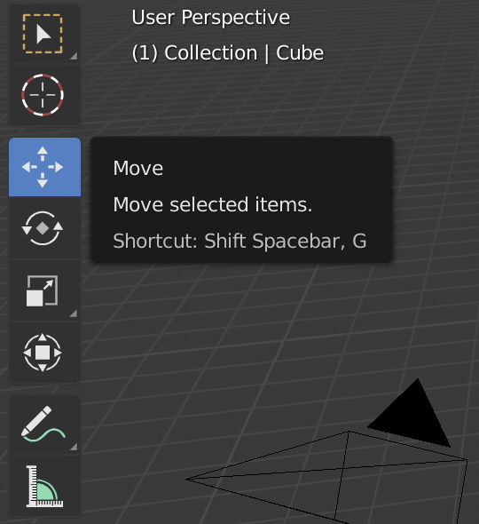

## Selecteren en verplaatsen

To select an object in Blender, use the left mouse button.

+ Select the cube with the left mouse button. Je ziet een oranje rand rond de kubus.

In Blender you can move objects by using the blue, green, and red handles: The blue handle to go up and down on the z-axis, the green handle to go left and right on the y-axis, and the red handle to go in and out on the x-axis. From Blender 2.8, you will need to click on the move gizmo from the list of icons on the left of your screen to make the handles appear.

+ Verplaats de kubus naar boven door met de linkermuisknop op de blauwe hendel te drukken en omhoog te bewegen. Wanneer je op de blauwe hendel drukt, zie je een blauwe lijn verschijnen. Verplaats de kubus langs de blauwe lijn.

+ Verplaats de kubus naar rechts door op de groene hendel met de linkermuisknop te drukken en deze naar rechts te verplaatsen. Wanneer je op de groene hendel drukt, zie je een groene lijn verschijnen. Verplaats de kubus langs de groene lijn.

+ Verplaats de kubus naar binnen of naar buiten door met de linkermuisknop op de rode hendel te drukken en deze heen en weer te bewegen. Wanneer je op de rode hendel drukt, zie je een rode lijn verschijnen. Verplaats de kubus langs de rode lijn.

+ Verplaats de kubus in je scène naar een andere positie.

+ Ga naar de renderweergave om te zien hoe deze eruit zal zien. Bijvoorbeeld:

You might see nothing or only part of the cube. This means that the object is not (completely) in the camera's view.

+ Press <kbd>ESC</kbd> to get out of the render view.

+ Verplaats de 3D-scène met de middelste muisknop naar achter de camera. For example:

+ Verplaats de kubus met de blauwe, groene en rode hendels, zodat je de kubus achter de camera kunt zien.

+ Render opnieuw om te zien hoe je afbeelding er uitziet. Je zult waarschijnlijk dezelfde afbeelding zien als voorheen.

+ Druk op <kbd>ESC</kbd> om de render weergave te verlaten.