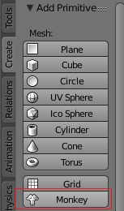

## Voeg een aap toe

We hebben de kubus niet nodig, dus laten we hem verwijderen.

+ Select the cube with the left mouse button. Rondom de kubus zou een oranje rand moeten verschijnen.
+ Zorg ervoor dat je muis in de 3D-weergave staat.
+ Druk op <kbd>X</kbd> om de kubus te verwijderen.
+ Je wordt gevraagd of het OK is om het object te verwijderen.

+ Selecteer **Delete** of druk op <kbd>Enter</kbd>.

To add objects to the scene, you can use the **Add** dropdown menu.

+ In the menu, go to the **Mesh** section and select **Monkey**.

Er verschijnt een aap in je scène.

+ Plaats de aap net voor de camera op dezelfde manier als met de kubus, zodat we deze na het renderen kunnen zien. Je kunt de blauwe, groene en rode hendels gebruiken om de aap te verplaatsen.

