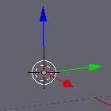
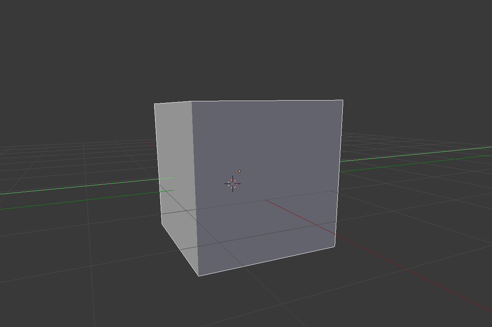

## Selecteren en verplaatsen

Om een ​​object in Blender te selecteren, moet je de rechtermuisknop gebruiken. In de meeste andere software zou je de linkermuisknop gebruiken om een ​​object te selecteren, maar in Blender is het de rechter.

+ Selecteer de kubus met de rechter muisknop. Je ziet een oranje rand rond de kubus.

In Blender kun je objecten verplaatsen met de blauwe, groene en rode hendels: de blauwe hendel om op en neer te gaan over de z-as, de groene hendel om links en rechts over de y-as te gaan, en de rode hendel om naar voor en naar achter te gaan over de x-as.

+ Verplaats de kubus naar boven door met de linkermuisknop op de blauwe hendel te drukken en omhoog te bewegen. Wanneer je op de blauwe hendel drukt, zie je een blauwe lijn verschijnen. Verplaats de kubus langs de blauwe lijn.

+ Verplaats de kubus naar rechts door op de groene hendel met de linkermuisknop te drukken en deze naar rechts te verplaatsen. Wanneer je op de groene hendel drukt, zie je een groene lijn verschijnen. Verplaats de kubus langs de groene lijn.

+ Verplaats de kubus naar binnen of naar buiten door met de linkermuisknop op de rode hendel te drukken en deze heen en weer te bewegen. Wanneer je op de rode hendel drukt, zie je een rode lijn verschijnen. Verplaats de kubus langs de rode lijn.

+ Verplaats de kubus in je scène naar een andere positie.

+ Ga naar de renderweergave om te zien hoe deze eruit zal zien. Bijvoorbeeld:

Mogelijk zie je niets of slechts een deel van de kubus. Dit betekent dat het object niet (volledig) in het zicht van de camera staat.

+ Druk op <kbd>ESC</kbd> om uit de weergave te komen.

+ Verplaats de 3D-scène met de middelste muisknop naar achter de camera. Bijvoorbeeld:

+ Verplaats de kubus met de blauwe, groene en rode hendels, zodat je de kubus achter de camera kunt zien.

+ Render opnieuw om te zien hoe je afbeelding er uitziet. Je zult waarschijnlijk dezelfde afbeelding zien als voorheen.

+ Druk op <kbd>ESC</kbd> om de render weergave te verlaten.