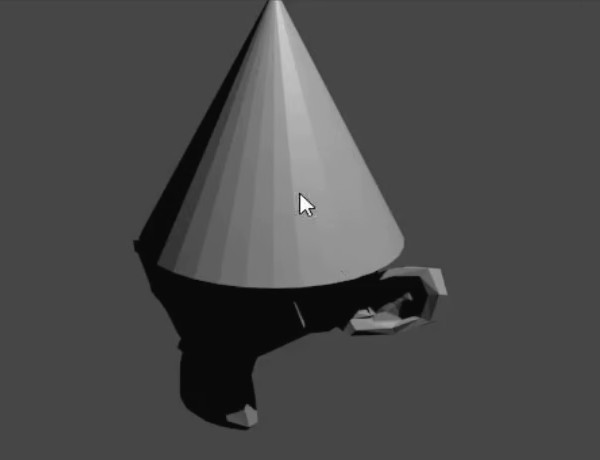

## Voeg een hoed toe

We kunnen ook een hoed toevoegen. Hiervoor gebruiken we een kegel.

+ Select **Cone** from the **Mesh** section.

Er verschijnt een kegel in je scène. Nu heb je een aap en een kegel.

Nu moet de kegel bovenop de aap worden geplaatst.

+ Draai en zoom een ​​beetje in de richting van de kegel en de aap om beide objecten beter te kunnen zien.

+ Select the cone using the left mouse button. Er moet weer een oranje rand omheen verschijnen.

+ Use the move gizmo and the blue, green, and red handles to move the cone on top of the monkey. Mogelijk moet je draaien en in- en uitzoomen om een ​​goed beeld te krijgen.

+ Controleer vanuit verschillende hoeken of de kegel juist op de bovenkant van de aap is geplaatst.

Nu moeten we zien hoe het eruit ziet.

+ Render de afbeelding.

De afbeelding laat zien dat de aap niet goed belicht is.

+ Druk op <kbd>ESC</kbd> om de weergave te verlaten.