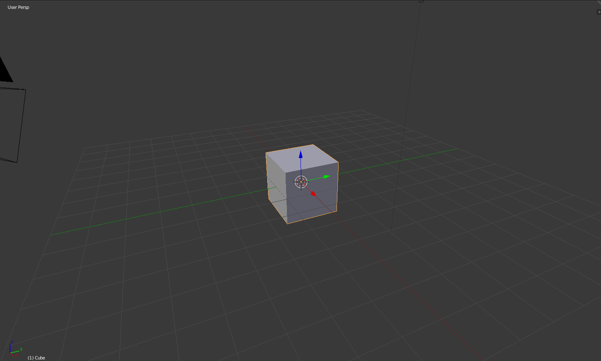

## Zoom e rotação

+ Abra o Blender.

Quando abrir o Blender, irá aparecer uma tela inicial. A tela inicial do Blender v2.81 é assim:

Para este tutorial, não precisaremos da tela inicial.

+ Clique à direita da tela inicial para fazê-la desaparecer.

No centro, você verá a vista 3D. Nesse espaço, você posicionará todos os itens que precisam ser exibidos ou renderizados. Você já tem três itens diferentes na visualização 3D. Iremos falar sobre eles mais tarde.

Na visualização 3D, você pode aumentar e diminuir o zoom usando a roda do mouse.

+ Tente aumentar e diminuir o zoom.

Você pode girar a cena pressionando o botão do meio ou a roda do mouse e girando ao redor.

+ Tente girar sua cena.

