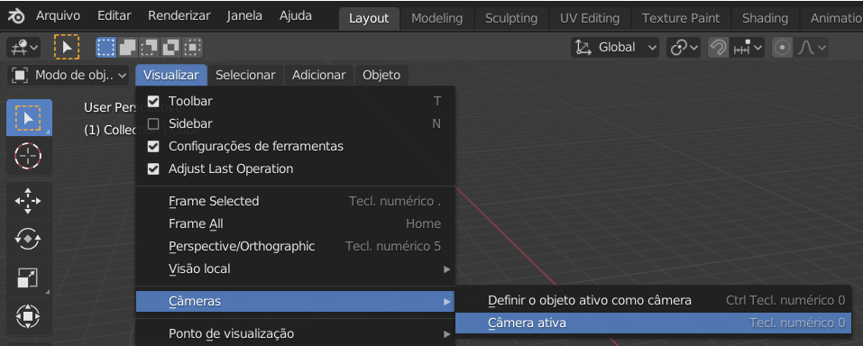

## A cena 3D

Na visualização 3D, você tem sua cena 3D, que se parece um pouco com o que você pode ver em um jogo de computador, por exemplo.

Existem três componentes principais na cena 3D que precisamos entender para começar.

### Um cubo no centro

É isso que será renderizado e mostrado na imagem.

### Uma fonte de luz

Ao girar a cena, você pode ver a posição exata da fonte de luz.

+ Gire sua cena até ver o topo da fonte de luz.

### Uma câmera

É por aqui que você verá sua cena.

+ Gire sua cena para que fique atrás da câmera. Uma maneira fácil de fazer isso é pressionar `0` no teclado numérico ou vá para `View` > `Cameras` > `Active Cameras`.

Você verá uma bela imagem do lado do cubo.