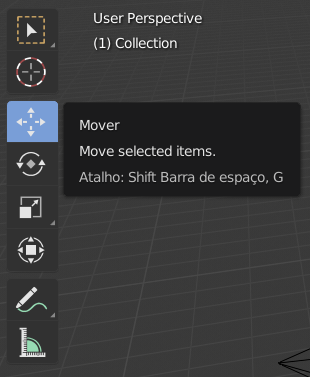
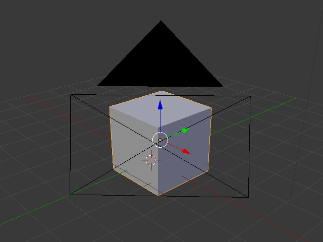

## Selecionando e movendo

Para selecionar um objeto no Blender, use o botão esquerdo do mouse.

+ Selecione o cubo com o botão esquerdo do mouse. Você verá uma borda laranja ao redor do cubo.

No Blender, você pode mover objetos usando as alças azul, verde e vermelha: a alça azul para subir e descer no eixo z, a alça verde para mover para a esquerda e direita no eixo y, e a alça vermelha para entrar e sair no eixo x. No Blender 2.8, você precisará clicar no gizmo de movimentação na lista de ícones à esquerda da tela para fazer as alças aparecerem.

+ Mova o cubo para cima pressionando a alça azul com o botão esquerdo do mouse e movendo-a para cima. Ao pressionar a alça azul, você verá uma linha azul aparecer. Mova o cubo ao longo da linha azul.

+ Mova o cubo para a direita pressionando a alça verde com o botão esquerdo do mouse e movendo-o para a direita. Ao pressionar a alça verde, você verá uma linha verde aparecer. Mova o cubo ao longo da linha verde.

+ Mova o cubo para dentro ou para fora pressionando a alça vermelha com o botão esquerdo do mouse e movendo-o para frente e para trás. Ao pressionar a alça vermelha, você verá uma linha vermelha aparecer. Mova o cubo ao longo da linha vermelha.

+ Mova o cubo ao redor da cena para uma posição diferente.

+ Vá para a exibição de renderização para ver como ela será. Por exemplo:

Você pode não ver nada ou ver apenas parte do cubo. Isso significa que o objeto não está (completamente) na visão da câmera.

+ Pressione <kbd> ESC </kbd> para sair da visualização de renderização.

+ Mova a cena 3D com o botão do meio do mouse para trás da câmera. Por exemplo:

+ Mova o cubo usando as alças azul, verde e vermelha, para poder ver o cubo por detrás da câmera.

+ Renderize novamente para ver como a imagem está. Você provavelmente verá a mesma imagem de antes.

+ Pressione <kbd> ESC </kbd> para sair da visualização de renderização.