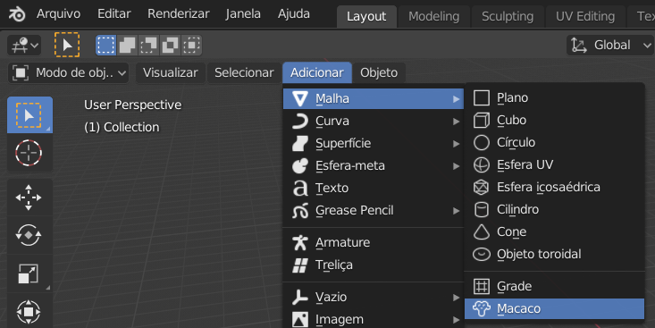
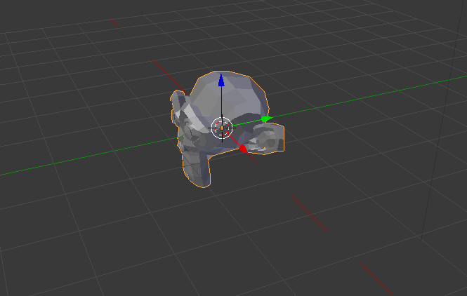

## Adicione um macaco

Não vamos precisar do cubo, então vamos removê-lo.

+ Selecione o cubo usando o botão esquerdo do mouse. Uma borda laranja deve aparecer ao redor do cubo.
+ Certifique-se de que seu mouse está na vista 3D.
+ Pressione <kbd>X</kbd> para deletar o cubo.
+ Será perguntado se está tudo bem em deletar o objeto.

+ Selecione **Delete** ou pressione <kbd>Enter</kbd>.

Para adicionar objetos à cena, você pode usar o menu suspenso **Adicionar**.

+ No menu, vá à seção **Malha** e selecione **Macaco**.

Um macaco vai aparecer em sua cena.

+ Posicione o macaco em frente à câmera, assim como fez com o cubo, para que possamos vê-lo após a renderização. Você pode usar as alças azul, verde e vermelha novamente para mover o macaco.

