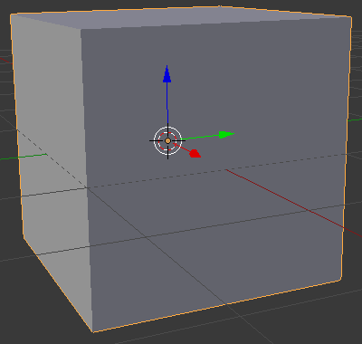
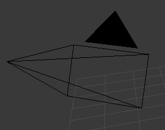
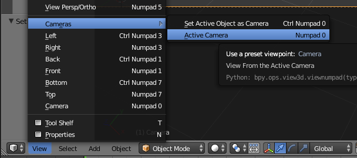

## Scena 3D

În vizualizarea 3D ai propria scena 3D, care arată asemănător cu ceea ce ai putea vedea într-un joc pe calculator, de exemplu.

Există trei componente principale în scena 3D pe care trebuie să le înțelegem pentru a începe.

### Un cub în centru

Aceasta este obiectul ce va fi randat și arătat la final.

### O sursă de lumină

Prin rotirea scenei poți vedea poziția exactă a sursei de lumină.

+ Rotește scena până când vezi partea superioară a sursei de lumină.

### O cameră

Acesta este locul de unde vei vedea scena ta.

+ Rotește-ți scena astfel încât să fie în spatele camerei. O modalitate ușoară de a face acest lucru este de a apăsa tasta numerică `0`, sau mergi la `View` > `Cameras` > `Active Cameras`.

You will see a nice picture of the side of the cube.