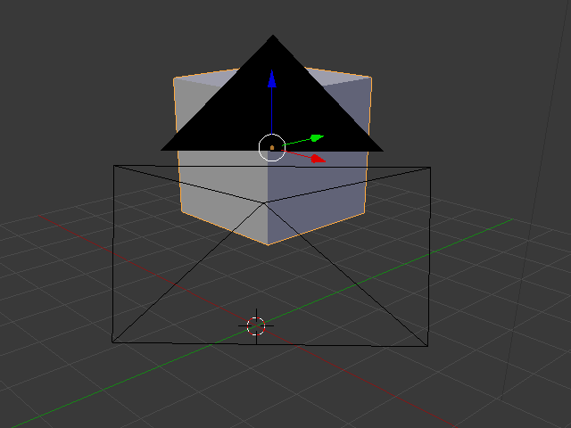

## Selectarea și mutarea

To select an object in Blender, use the left mouse button.

+ Select the cube with the left mouse button. Vei vedea o margine portocalie în jurul cubului.

In Blender you can move objects by using the blue, green, and red handles: The blue handle to go up and down on the z-axis, the green handle to go left and right on the y-axis, and the red handle to go in and out on the x-axis. From Blender 2.8, you will need to click on the move gizmo from the list of icons on the left of your screen to make the handles appear.

+ Mută cubul în sus apăsând săgeata albastră cu butonul stâng al mouse-ului și deplasându-l în sus. Când apeși săgeata albastră, vei vedea o linie albastră. Deplasază cubul de-a lungul liniei albastre.

+ Deplasează cubul spre dreapta apăsând săgeata verde cu butonul stâng al mouse-ului și mută-l spre dreapta. Când apeși săgeata verde, vei vedea o linie verde. Deplasează cubul de-a lungul liniei verzi.

+ Deplasează cubul pe adăncime apăsând săgeata roșie cu butonul stâng al mouse-ului și mută-l înainte și înapoi. Când apeși săgeata roșie, vei vedea o linie roșie. Deplasează cubul de-a lungul liniei roșii.

+ Deplasează cubul în cadrul scenei la o poziție diferită.

+ Accesează ecranul de randare pentru a vedea cum va arăta. De exemplu:

You might see nothing or only part of the cube. This means that the object is not (completely) in the camera's view.

+ Press <kbd>ESC</kbd> to get out of the render view.

+ Mută scena 3D cu butonul mijlociu al mouse-ului în spatele camerei. For example:

+ Deplasează cubul folosind săgețile astfel încât să poți vedea cubul din spatele camerei.

+ Repetă din nou pentru a vedea cum arată imaginea ta. Probabil că vei vedea aceeași imagine ca înainte.

+ Apăsă <kbd>ESC</kbd> pentru a ieși din vizualizarea de randare.