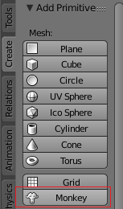

## Adaugă o maimuță

Nu vom avea nevoie de cub, deci să-l eliminăm.

+ Selectează cubul cu butonul stâng al mouse-ului. O margine portocalie ar trebui să apară în jurul cubului.
+ Asigură-te că ai cursorul în vizualizarea 3D.
+ Apasă pe <kbd>X</kbd> pentru a șterge cubul.
+ Vei fi întrebat dacă este OK să ștergi obiectul.

+ Selectează **Delete** sau apasă <kbd>Enter</kbd>.

Pentru a adăuga obiecte la scenă, poți utiliza meniul derulant **Add**.

+ În meniu, accesează secțiunea **Mesh** și selectează **Monkey**.

O să îți apară o maimuță în scenă.

+ Poziționează maimuța în fața camerei, așa cum ai făcut la cub, astfel încât să îl poți vedea după randare. Poți folosi din nou săgețile pentru a muta maimuța.

