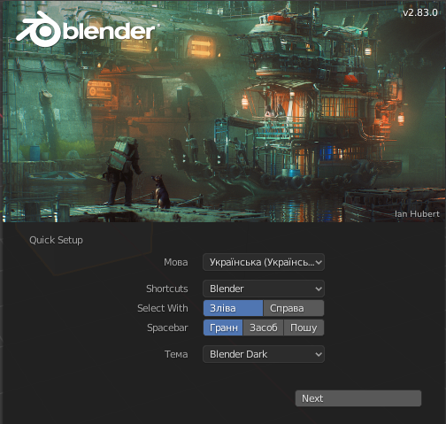

## Наближення/віддалення та обертання

+ Відкрий Blender.

Коли ти відкриєш Blender, він покаже початковий екран. Ось як виглядає початковий екран Blender v2.83.0:

Для цього уроку нам не потрібен буде цей початковий екран.

+ Клацни справа від початкового екрану, щоб він зник.

Посередині ти побачиш 3D-вікно. В цьому просторі ти будеш розміщувати всі елементи, які необхідно відобразити або візуалізувати. В тебе вже є три різних елементи в 3D-вікні. Ми їх розглянемо пізніше.

У цьому 3D-вікні ти можеш наближатися і віддалятися за допомогою колеса мишки.

+ Спробуй наблизити та віддалити куб.

Ти можеш повернути сцену повністю, затиснувши середню кнопку мишки або її колесо і протягнуши вказівник.

+ Спробуй повернути сцену.

