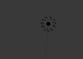

## 3D-сцена

У 3D-вікні є 3D-сцена, яка виглядає так, ніби ти знаходишся в комп’ютерній грі.

Для початку нам треба розібратися з трьома головними компонентами 3D-cцени.

### Куб у центрі

Це те, що буде візуалізовано та показано на картинці.

### Джерело світла

Обертаючи сцену, ти можеш бачити точне розміщення джерела світла.

+ Обертай сцену, поки не побачиш джерело світла зверху.

### Камера

Це та точка, з якої ти бачитимеш свою сцену.

+ Обертай сцену, щоб вона опинилася перед камерою. Простий спосіб це зробити — натиснути `0` на цифровій клавіатурі, або перейти у `Огляд` > `Камери` > `Активна Камера`.

Ти побачиш чудове зображення сторони куба.