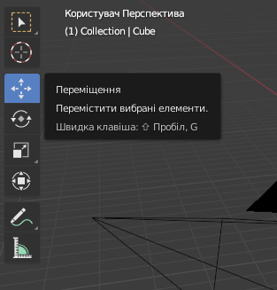

## Виділення та переміщення

Для вибору об’єкту в Blender використовуй ліву клавішу мишки.

+ Виділи куб лівою клавішею мишки. Ти побачиш оранжевий контур навколо куба.

У Blender ти можеш переміщувати об’єкти за допомогою синьої, зеленої та червоної направляючих: синя направляюча дозволяє рухатися вгору і вниз по осі z, зелена — вліво та вправо по осі y, а червона — наближати та віддаляти по осі x. Починаючи з Blender 2.8, щоб направляючі з’явилися, тобі треба вибрати інструмент переміщення зі списку іконок в лівій частині екрану.

+ Перемісти куб вгору, затиснувши синю направляючу лівою кнопкою мишки і пересунувши її вгору. Коли ти натиснеш на синю направляючу, то побачиш, як з’явиться синя лінія. Перемісти куб вздовж неї.

+ Перемісти куб вправо, затиснувши зелену направляючу лівою кнопкою мишки і пересунувши її вправо. Коли ти натиснеш на зелену направляючу, то побачиш, як з’явиться зелена лінія. Перемісти куб вздовж неї.

+ Перемісти куб на себе або від себе, затиснувши червону направляючу лівою кнопкою мишки і пересунувши її вперед або назад. Коли ти натиснеш на червону направляючу, то побачиш, як з’явиться червона лінія. Перемісти куб вздовж неї.

+ Переміщуй куб по сцені в різні місця.

+ Перейди у вікно візуалізації, щоб побачити, як це виглядатиме. Наприклад:

Ти можеш нічого не побачити, або побачити лише частину куба. Це означає, що об’єкт не знаходиться (повністю) в полі зору камери.

+ Натисни <kbd>ESC</kbd>, щоб закрити вікно візуалізації.

+ Покрути 3D-сцену за допомогою середньої кнопки мишки, щоб стати позаду від камери. Наприклад:

+ Переміщуй куб за допомогою синьої, зеленої та червоної направляючих, щоб ти побачив(-ла) куб в полі зору камери.

+ Зроби візуалізацію знову, щоб перевірити, як виглядатиме зображення. Напевно, ти побачиш зображення так, як і бачив(-ла) раніше.

+ Натисни <kbd>ESC</kbd>, щоб закрити вікно візуалізації.