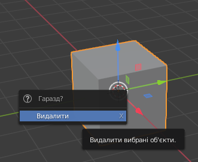
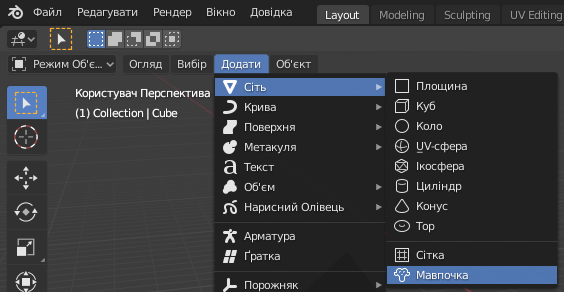

## Додай мавпочку

Нам не знадобиться куб, тому давай його видалимо.

+ Вибери куб за допомогою лівої кнопки мишки. Навколо куба має з’явитися оранжевий контур.
+ Переконайся, що твоя мишка знаходиться у 3D-вікні.
+ Натисни <kbd>X</kbd> (на латинській розкладці), щоб видалити куб.
+ Тебе запитають, чи ти дійсно хочеш видалити цей об’єкт.

+ Вибери **Видалити** і натисни <kbd>Enter</kbd>.

Щоб додати об’єкти до сцени, ти можеш використовувати спадне меню **Додати**.

+ В меню перейди в розділ **Сіть** і вибери **Мавпочка**.

Мавпочка з’явиться на твоїй сцені.

+ Розмісти мавпочку в полі зору камери, як ти робив(-ла) із кубом, щоб вона була видима після візуалізації. Ти можеш використовувати синю, зелену та червону направляючі, щоб перемістити мавпочку.

