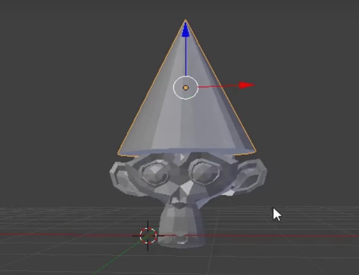

## Додай шапочку

Ми також можемо додати шапочку. Для цього ми будемо використовувати конус.

+ Вибери **Конус** із розділу **Сіть**.

На твоїй сцені має з’явитися конус. Тепер в тебе є мавпочка і конус.

Тепер конус треба поставити на мавпочку.

+ Трошки поверни та наблизь зображення до мавпочки та конуса, щоб краще бачити обидва об’єкти.

+ Виділи конус за допомогою лівої кнопки мишки. Як і раніше, навколо нього має з’явитися оранжевий контур.

+ Використовуй інструмент переміщення, а також синю, зелену та червону направляючі, щоб поставити конус на мавпочку. Тобі, можливо, треба буде повертати і наближати або віддаляти зображення, щоб добре все бачити.

+ Перевір з різних сторін чи конус розміщено зверху від мавпочки правильно.

Тепер нам потрібно подивитися, як він виглядатиме.

+ Візуалізуй зображення.

Зображення показує, що мавпочку не дуже добре освітлено.

+ Натисни <kbd>ESC</kbd>, щоб вийти із вікна візуалізації.